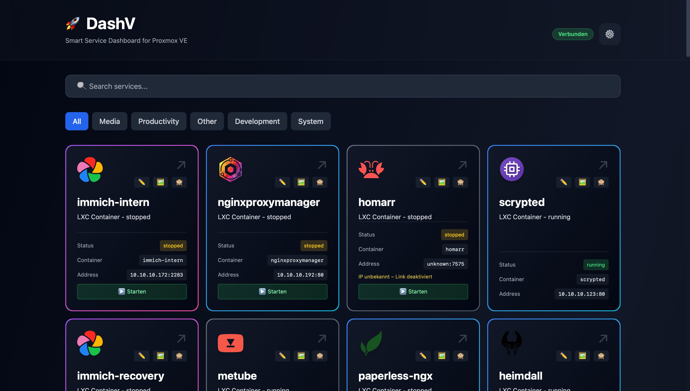
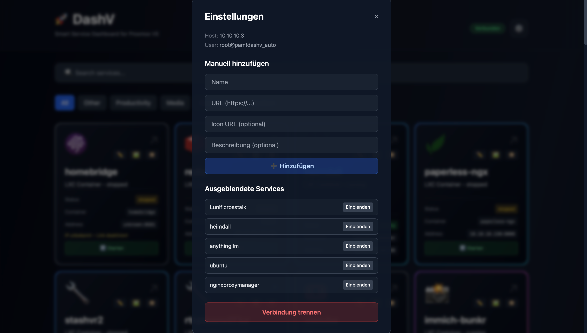
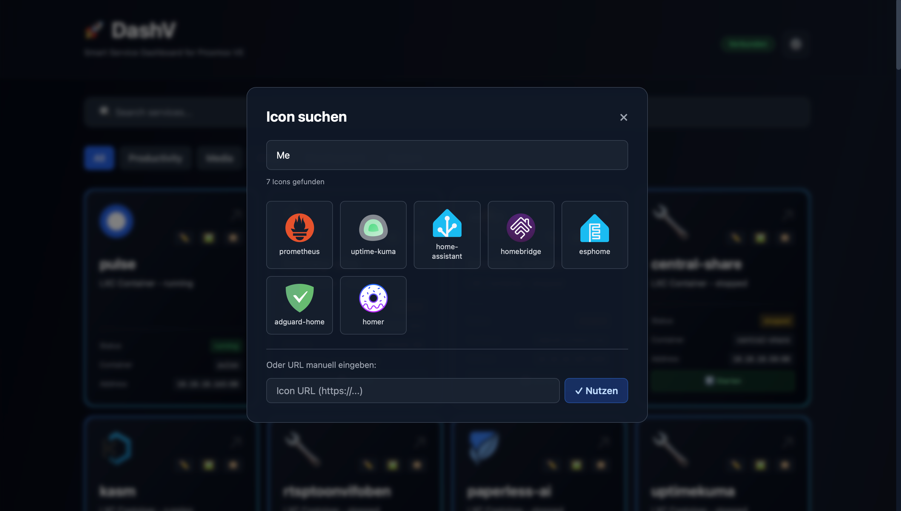

# DashV - Proxmox Service Dashboard

Automatic service discovery dashboard for Proxmox with real-time updates.

## 🚀 Features

- **Automatic Service Discovery**: Connect your Proxmox host via API and DashV automatically finds running services
- **Real-time Updates**: WebSocket-based live updates when services change
- **Container Support**: Supports LXC containers and QEMU VMs
- **Change Tracking**: Track service changes over time
- **Modern UI**: React + Tailwind CSS Dashboard
- **Responsive Design**: Works on desktop, tablet, and mobile
- **Backup Function**: Automatic backup and restore functionality for services and configuration
- **Multi-Language Support**: Switch between multiple languages for global accessibility
- **Highly Customizable**: Personalize your dashboard with custom themes, layouts, and service categories

## 📸 Screenshots

### Service Dashboard
The main dashboard displays all discovered services in a clear grid. Each service is categorized (Media, Productivity, Development, System, etc.) and shows important information like status, container name, and IP address.



### Settings & Proxmox Connection
Configure your Proxmox connection and manage services. Set the host address, add manual services, or disconnect.



### Icon Selection
Choose automatically detected icons or add custom icon URLs. The system has a large collection of pre-configured icons.



## 📋 Requirements

### Node.js 20+
Node.js is the runtime environment for the backend and frontend build tools.

**Installation:**
- **Windows/macOS**: [nodejs.org](https://nodejs.org/en/download) - Download the LTS version
- **Linux (Ubuntu/Debian)**: 
  ```bash
  curl -fsSL https://deb.nodesource.com/setup_20.x | sudo -E bash -
  sudo apt-get install -y nodejs
  ```
- **Linux (Fedora/RHEL)**:
  ```bash
  sudo dnf install nodejs
  ```

**Verification:**
```bash
node --version
npm --version
```

### Docker & Docker Compose
Docker is used to containerize all services (Frontend, Backend, PostgreSQL).

**Installation:**
- **Windows/macOS**: [Docker Desktop](https://www.docker.com/products/docker-desktop) - Includes Docker and Docker Compose
- **Linux (Ubuntu/Debian)**:
  ```bash
  curl -fsSL https://get.docker.com -o get-docker.sh
  sudo sh get-docker.sh
  sudo usermod -aG docker $USER
  newgrp docker
  ```
  Then install Docker Compose:
  ```bash
  sudo curl -L "https://github.com/docker/compose/releases/latest/download/docker-compose-$(uname -s)-$(uname -m)" -o /usr/local/bin/docker-compose
  sudo chmod +x /usr/local/bin/docker-compose
  ```
- **Linux (Fedora/RHEL)**:
  ```bash
  sudo dnf install docker docker-compose
  sudo systemctl start docker
  sudo usermod -aG docker $USER
  ```

**Verification:**
```bash
docker --version
docker compose version
```

### PostgreSQL
PostgreSQL runs automatically in Docker and is provided via `docker-compose.yml`. No separate installation is required.

### Proxmox Host with API Access
You need a Proxmox host with API access enabled. DashV connects via the Proxmox API and requires appropriate permissions.

## 🛠️ Installation & Setup

### 1. Clone Repository
```bash
git clone https://github.com/heberlej/dashv.git
cd dashv
```

### 2. Install Dependencies
```bash
npm install
```

### 3. Set Configuration
Copy the example environment and adjust the values:
```bash
cp .env.example .env
```

### 4. Start Services (Docker)
```bash
docker compose up -d
```

The following services will start:
- **Frontend**: http://localhost:80
- **Backend**: http://localhost:3003
- **PostgreSQL**: localhost:5432

### 5. Start Frontend & Backend Development
```bash
npm run dev
```

This starts both frontend and backend in watch mode in parallel.

## 📝 Proxmox Connection

1. Open the dashboard at http://localhost:80
2. Use the connection form to connect your Proxmox host
3. Enter the following information:
   - **Host**: e.g. `proxmox.example.com`
   - **User**: e.g. `root@pam`
   - **API Token**: Your Proxmox API token

> **Tip**: Create API tokens in Proxmox under Datacenter → Permissions → API Tokens

## ⚙️ Configuration

All configuration values are in [.env](.env) and are loaded via environment variables. Examples can be found in [.env.example](.env.example).

Important variables:
- `PROXMOX_HOST`, `PROXMOX_USER`, `PROXMOX_TOKEN_ID`, `PROXMOX_TOKEN_SECRET`
- `FRONTEND_URL`, `PORT`, `VITE_API_URL`

## 🔐 Security & Privacy

- **No Secrets in Repo**: `.env` is included in `.gitignore`.
- **Store Tokens Locally Only**: Use Proxmox API tokens with minimal permissions.
- **HTTPS Recommended**: For public deployments, terminate TLS (e.g. via Traefik/Nginx).

## 🏗️ Project Structure

```
dashv/
├── frontend/           # React + TypeScript UI
│   ├── src/
│   │   ├── components/
│   │   ├── App.tsx
│   │   └── main.tsx
│   └── vite.config.ts
├── backend/            # Node.js/Express API
│   ├── src/
│   │   ├── services/
│   │   │   ├── ProxmoxManager.ts
│   │   │   ├── DatabaseManager.ts
│   │   │   └── ServiceDiscovery.ts
│   │   └── index.ts
│   └── tsconfig.json
├── shared/             # Shared Types
└── docker-compose.yml
```

## 🔧 Technologies

### Frontend
- **React 18** - UI Framework
- **TypeScript** - Type Safety
- **Tailwind CSS** - Styling
- **Vite** - Build Tool
- **Socket.io Client** - WebSocket Client

### Backend
- **Node.js/Express** - HTTP Server
- **TypeScript** - Type Safety
- **Socket.io** - WebSocket Server
- **PostgreSQL** - Database
- **Axios** - HTTP Client (Proxmox API)

### Infrastructure
- **Docker Compose** - Local Development
- **PostgreSQL 16** - Persistent Data Storage

## 📡 API Endpoints

### Services
```
GET /api/services           # All known services
POST /api/proxmox/connect   # Connect to Proxmox
GET /health                 # Health check
```

### WebSocket Events
```
service:added       # New service discovered
service:updated     # Service updated
service:removed     # Service removed
```

## 🔄 Service Discovery Process

1. **Initialization**: Connect to Proxmox host
2. **Container Listing**: Fetch all LXC containers & QEMU VMs
3. **Port Mapping**: Determine typical service ports based on name
4. **IP Resolution**: Fetch container IPs
5. **Service Detection**: Identify running services
6. **Storage**: Store services in PostgreSQL
7. **Live Updates**: Send changes to frontend via WebSocket

## 🧪 Development

### Build Backend
```bash
npm run build -w backend
```

### Build Frontend
```bash
npm run build -w frontend
```

### Type Checking
```bash
npm run type-check
```

### Linting
```bash
npm run lint
```

## 🐳 Docker

### Local Development
```bash
docker-compose up -d
```

### View Logs
```bash
docker-compose logs -f backend
docker-compose logs -f frontend
```

### Stop Everything
```bash
docker-compose down
```

## 🚀 Production Deployment

For production, you should:
- Configure environment variables (`.env`)
- Compile TypeScript
- Build production Docker images
- Run database migrations
- Configure HTTPS

## 📚 Further Information

- Architecture: [ARCHITECTURE.md](ARCHITECTURE.md)
- Quick Start: [QUICKSTART.md](QUICKSTART.md)
- Development: [DEVELOPMENT.md](DEVELOPMENT.md)
- [Proxmox API Documentation](https://pve.proxmox.com/pve-docs/api-viewer/)
- [React Documentation](https://react.dev)
- [Tailwind CSS Documentation](https://tailwindcss.com)

## 🤝 Contributing

Pull requests are welcome! Please open an issue first to discuss changes.

## 📄 License

MIT

## 👨‍💻 Development

Developed with ❤️ for Proxmox enthusiasts
